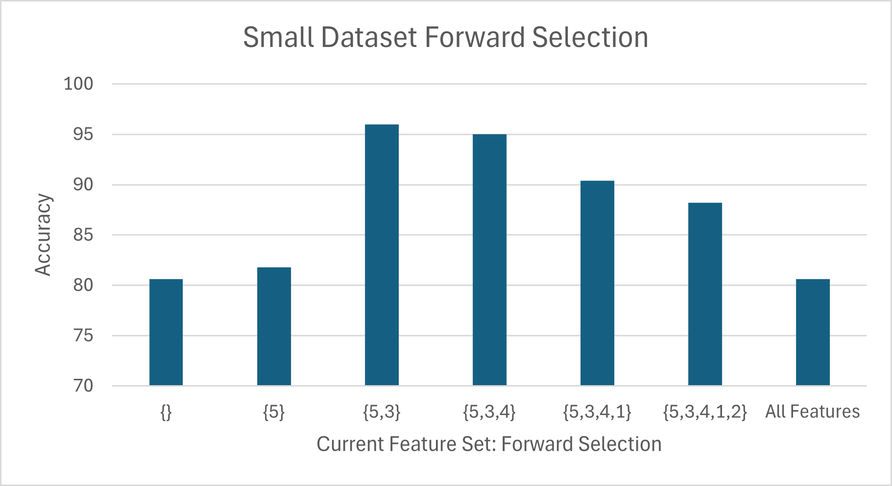
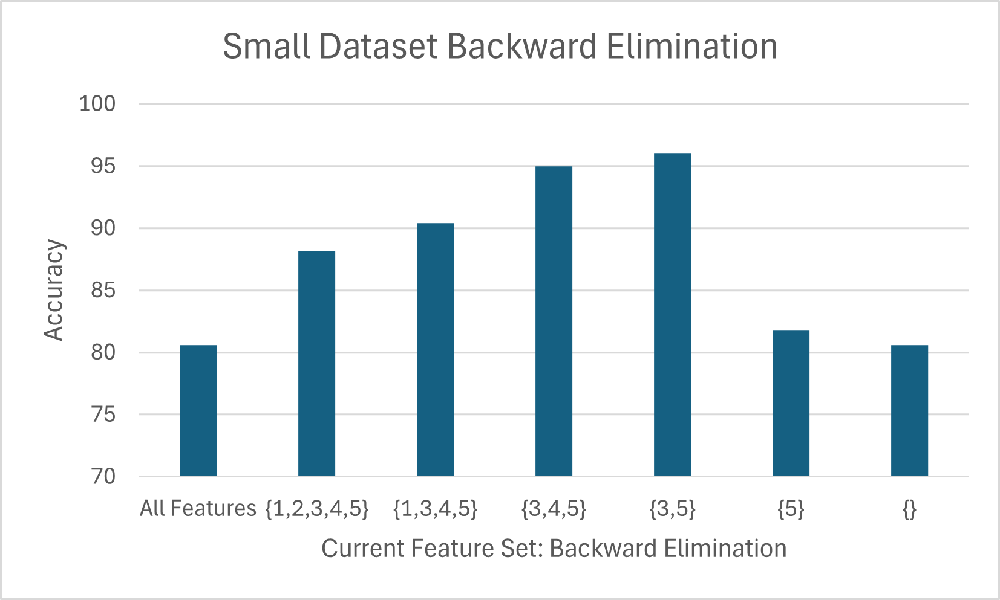
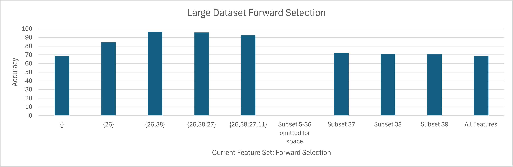
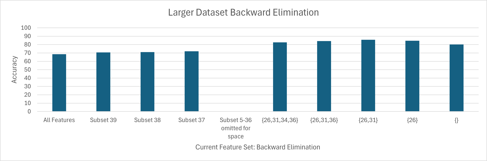

# Feature Selection with Nearest Neighbor Classifier

## Introduction
This project focuses on implementing a nearest neighbor classifier within a wrapper method to perform feature selection. The core objective is to identify the most relevant features in a dataset to improve classification accuracy and reduce comuptational complexity. Two popular approaches are evaluated: forward selecrtion and backward elimination.

## Features
- Implementation of Forward Selection and Backward Elimination
- Uses Leave-One-Out Cross-Validation (LOOCV) for accuracy evaluation
- Compatible with custom `.txt` datasets
- Tracks and displays accuracy at each feature set selection step
- Runtime tracking for small and large datasets

## Tools Used

- **Python 3.12** — Main programming language
- **NumPy** — Efficient numerical operations
- **Excel** — For data analysis and visualization
- **VSCode** — Development environment
- **GitHub** — Version control and project hosting

## Forward Selection vs Backward Elimination
### Forward Selection
This method begins with an empty feature set and adds one feature at a time, selecting the one that improves the model's performance the most at each step. The process continues until no further improvement is observed. This greedy strategy is effective in detecting strong individual features and avoids early inclusion of noisy data.
### Backward Elimination
Conversely, this method starts with all available features and removes one at a time, discarding the feature whose removal leads to the least drop (or greatest gain) in performance. It continues until further removal deteriorates accuracy. This technique is more aggressive and can help eliminate redundant or irrelevant features.

## Small Dataset Results (6 Feature, 500 Instances)
### Forward Selection
* Default (no features): 80.6% accuracy
* Best single feature: Feature 5, accuracy rose to 81.8%
* Adding Feature 3 next increased accuracy to 96%
* Adding more features after that led to a decline in performance
* Best feature subset: {3, 5}, achieving 96% accuracy


### Backward Elimination
* Starting with all features: 80.6% accuracy
* Removing Feature 6 boosted accuracy to 88.6%
* Further removals (2, then 1, then 4) improved it to 96%
* Removing either 3 or 5 caused significant drops in accuracy
* Again, {3, 5} emerged as the optimal subset



## Large Dataset Results (40 Features, 1000 Instances)
### Forward Selection
* Default accuracy: 70.6%
* Adding Feature 34: accuracy jumped to 84.2%
* Adding Feature 10: up to 95.2%
* Performence declined slightly after adding more subsets
* Best subset: {34, 10}, achieving 95.2% accuracy



### Backward Elimination
* Initial accuracy: 68.6%
* Removing irrelevant features gradually improved accuracy
* Peak accuracy at 85.8% with features {26, 31}
* Removing 26 dropped accuracy back to the default
* Feature 26 consistently appeared among the most useful, but the method failed to identify Feature 34, which was key in forward selection



## Sample Output for Small Dataset
``` python
The following is an example of Forward Selection on a small dataset

Welcome to Feature Selection Tool
Type in the name of the file to test
CS170_Small_Data__1.txt
Select algorithm:
1. Forward Selection
2. Backward Elimination
> 1
This dataset has 6 features (not including the class attribute), with 500 instances.
Running nearest neighbor with all 6 features, using leaving-one-out evaluation, I get an accuracy of 80.6%
Beginning search
  Using feature(s) {1} accuracy is 71.2%
  Using feature(s) {2} accuracy is 71.6%
  Using feature(s) {3} accuracy is 74.2%
  Using feature(s) {4} accuracy is 74.4%
  Using feature(s) {5} accuracy is 81.8%
  Using feature(s) {6} accuracy is 74.0%
Feature set [5] was best, accuracy is 81.8%
  Using feature(s) {5, 1} accuracy is 83.4%
  Using feature(s) {5, 2} accuracy is 87.4%
  Using feature(s) {5, 3} accuracy is 96.0%
  Using feature(s) {5, 4} accuracy is 82.4%
  Using feature(s) {5, 6} accuracy is 84.0%
Feature set [5, 3] was best, accuracy is 96.0%
  Using feature(s) {5, 3, 1} accuracy is 93.2%
  Using feature(s) {5, 3, 2} accuracy is 91.0%
  Using feature(s) {5, 3, 4} accuracy is 95.0%
  Using feature(s) {5, 3, 6} accuracy is 91.2%
(Warning, Accuracy has decreased! Continuing search in case of local maxima)
Feature set [5, 3, 4] was best, accuracy is 95.0%
  Using feature(s) {5, 3, 4, 1} accuracy is 90.4%
  Using feature(s) {5, 3, 4, 2} accuracy is 90.2%
  Using feature(s) {5, 3, 4, 6} accuracy is 88.8%
(Warning, Accuracy has decreased! Continuing search in case of local maxima)
Feature set [5, 3, 4, 1] was best, accuracy is 90.4%
  Using feature(s) {5, 3, 4, 1, 2} accuracy is 88.2%
  Using feature(s) {5, 3, 4, 1, 6} accuracy is 86.6%
(Warning, Accuracy has decreased! Continuing search in case of local maxima)
Feature set [5, 3, 4, 1, 2] was best, accuracy is 88.2%
  Using feature(s) {5, 3, 4, 1, 2, 6} accuracy is 80.6%
(Warning, Accuracy has decreased! Continuing search in case of local maxima)
Feature set [5, 3, 4, 1, 2, 6] was best, accuracy is 80.6%
Finished search!! The best feature subset is [5, 3], which has an accuracy of 96.0%
```

## Runtime Analysis

| Dataset Size       | Forward Selection | Backward Elimination |
|--------------------|-------------------|-----------------------|
| Small (6 features) | 0.4 minutes       | 0.4 minutes           |
| Large (40 features)| 0.92 hours        | 0.94 hours            |

## Conclusion
* Smaller datasets: Both methods performed similarly, accurately identifying {3, 5} as the best feature combination.
* Larger datasets: Forward selection was more reliable. It reached 95.2% accuracy, compared to 85.8% for backward elimination, which likely got stuck in a local maximum.
* Overall: Forward selection appears to be a safer and more consistent option for datasets with a large number of features.

## What I Learned
Working on this project gave me a much deeper understanding of how feature selection impacts classification performance. Some key takeaways:
- **Feature selection matters** — Removing irrelevant or redundant features significantly boosts accuracy and efficiency.
- **LOOCV is accurate but costly** — Especially with large feature sets, LOOCV can be slow, which is important to account for in real-world scenarios.
- **Backtracking logic is subtle** — Implementing feature selection algorithms helped me understand greedy heuristics better and how they can be both powerful and limited.
- **Debugging numerical results** — Validating accuracy outputs taught me how sensitive classification results are to data scaling and distance metrics.
